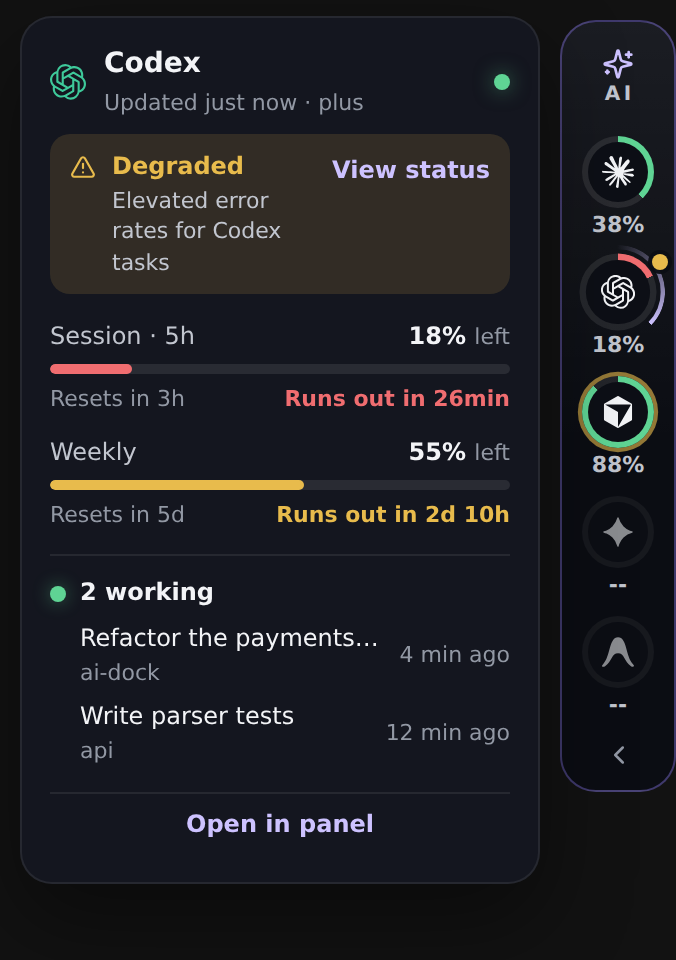
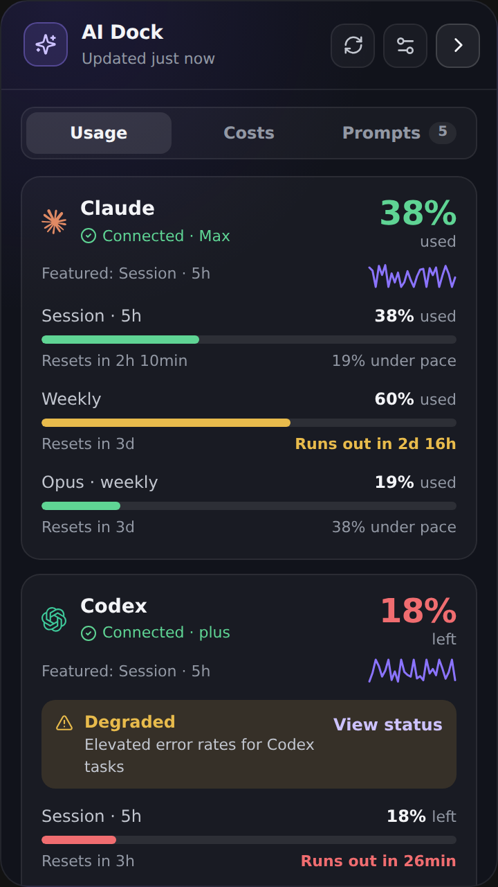
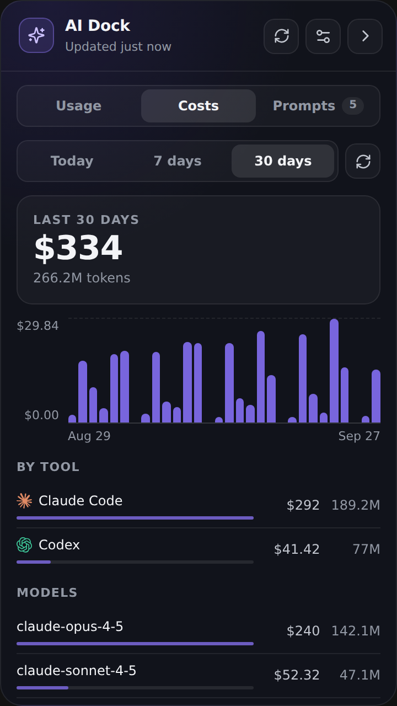

# AI Dock

A side dock for Windows 11, with a macOS beta, that shows **how much AI quota you have left** in Claude, Codex, Cursor and Antigravity, what your coding agents are doing, what that usage would cost on the API, and your **Obsidian prompt library**, one hover away.

[](CHANGELOG.md)
[](#download)
[](https://github.com/NyckDragon/ai-dock/releases/tag/macos-beta.1)
[](https://tauri.app)
[](LICENSE)

**English** · [Português](README.pt-BR.md)

<p>
  
  
  
</p>

## Download

### Windows 11

Get the installer (NSIS) or the portable `.exe` from [Releases](../../releases).

The binary is **not code-signed yet**, so Windows SmartScreen may warn the first time you open it (More info → Run anyway).

### macOS beta

Apple Silicon only. [Download the .dmg](https://github.com/NyckDragon/ai-dock/releases/download/macos-beta.1/AI-Dock-macOS-beta-aarch64.dmg). It is also on the [pre-release](https://github.com/NyckDragon/ai-dock/releases/tag/macos-beta.1), separate from the Windows 0.7.0 release.

The app is unsigned and not notarized. Gatekeeper warns the first time: right-click AI Dock → Open.

Testers are welcome. Open an [issue](https://github.com/NyckDragon/ai-dock/issues) with what broke: dock on the left and right edges, two monitors, switching Spaces, the tray, the shortcut, starting at login, quota for the four providers, hiding for a full-screen app, the dock coming back to the front, and pasting after Accessibility is allowed. There is no Intel build.

## Features

- **Always on top, out of the way.** Docks to the left or right edge of any display, at the height you pick. No taskbar icon. Auto-hides to a thin strip, and hides during full-screen apps.
- **Quota at a glance.** Four collapsed styles (ring, square, numbers, classic) colored by how much is left. Hover a provider for a peek with every window, reset countdown and plan.
- **Pace.** "Runs out in 2h 10min" or "19% under pace" for each window, plus a trend line for the last 24 hours, 7 days or 30 days.
- **Real plan names**, such as Claude Max 5x or Max 20x, when the provider reports them.
- **Service status.** Incidents from the official status pages of Claude, OpenAI (Codex) and Cursor show on the dock and in the cards, with a link to the status page.
- **Local costs.** Tokens and the estimated API cost of your Claude Code and Codex CLI sessions, per day, tool, model and project, read from their local logs.
- **Agent activity.** See when Codex, Cursor or Antigravity is working, and get a notification when an agent is waiting for you.
- **Notifications** for low quota (80% and 95% used), limit resets, service incidents, and a provider that stops refreshing (and when it recovers). Pause them for 30 min to "until tomorrow" from Settings or the tray.
- **Obsidian prompts.** Search, favorites, recents, `{{variables}}` filled in before copying, a global **Ctrl + Alt + Space** palette, and optional paste straight into the app you were in.
- English and Portuguese UI; light, dark or system theme; start with Windows.

## Providers

| Provider | What AI Dock reads | What it does **not** read |
| --- | --- | --- |
| **Claude** | The local Claude Code OAuth login, **or** the claude.ai session you sign in to inside AI Dock (or a cookie you paste by hand) | Chrome/Edge cookies, Claude Desktop's internal session |
| **Codex** | `~/.codex/auth.json` (or `CODEX_HOME`) and the ChatGPT usage endpoint | — |
| **Cursor** | The signed-in editor state in `%APPDATA%\Cursor\User\globalStorage\state.vscdb` (read-only) and `cursor.com/api/usage-summary` | Your account password or browser |
| **Antigravity** | The local language server of the installed app | Your Google account on the web |

### Connecting Claude

In **Settings → Connections → Sign in with claude.ai**, AI Dock opens claude.ai's own login page in its window. Sign in (use email if Google refuses the embedded window) and the window closes by itself.

After that AI Dock **renews the session on its own**: it keeps the cookies claude.ai rotates, and when the session stops working it reopens claude.ai hidden for a few seconds (at most every 20 minutes) so the site can refresh it. It only asks you to sign in again, with a notification, when claude.ai really signs you out. A Cloudflare challenge is not treated as an expired session: the last reading stays visible and marked as old.

Manual alternative: claude.ai DevTools → Application → Cookies → copy the whole table (or the `Cookie` header) and paste it in **Paste the cookie manually**. Never paste it in an issue.

### Costs

The **Costs** tab reads the JSONL logs Claude Code (`~/.claude/projects`) and the Codex CLI (`~/.codex/sessions`) already write on your PC, and prices each model with the public [LiteLLM price table](https://github.com/BerriAI/litellm). Subscriptions are not billed per token, so the number is **what the same usage would cost on the API**, not what you pay. Models missing from the table are counted in tokens only and marked with `+`.

## Privacy

AI Dock has no backend, account or telemetry. Everything runs on your PC.

- Claude Code, Codex and Cursor credentials are **read only**, never copied. Cursor's session stays in memory for the request.
- The Claude Web cookie is stored in **Windows Credential Manager**. On the macOS beta, the same values go in the login **Keychain**. Only `sessionKey`, `cf_clearance`, `__cf_bm` and `anthropic-device-id` are kept.
- The claude.ai window is remote content with no access to AI Dock's commands.
- AI Dock **never reads cookies from Chrome, Edge or any other browser**.
- The local cache and usage history hold quota numbers only, never credentials.

Network requests go only to:

| Where | Why |
| --- | --- |
| `api.anthropic.com`, `claude.ai` | Claude usage |
| `chatgpt.com` | Codex usage |
| `cursor.com` | Cursor usage |
| `status.claude.com`, `status.openai.com`, `status.cursor.com` | Public incident status, every 5 min |
| `raw.githubusercontent.com` | LiteLLM price table, at most once a day, cached on disk |

Details in [SECURITY.md](SECURITY.md).

## Prompts from Obsidian

Point AI Dock to your vault (or a folder inside it). Every `.md` file is a prompt; front matter is optional.

```md
---
title: Editorial campaign
category: Image
tags:
  - photo
favorite: true
---

Create an editorial campaign for {{brand}} with a {{tone|refined}} tone.
```

`{{name}}` becomes a field to fill in before copying; `{{name|default}}` comes prefilled.

## Requirements

- Windows 11 with [WebView2](https://developer.microsoft.com/microsoft-edge/webview2/) (already included in Windows 11)
- macOS beta: Apple Silicon
- The apps you want to track, signed in on the same computer

## Build from source

Needs Node.js 22+, Rust stable and the [Tauri 2 prerequisites](https://v2.tauri.app/start/prerequisites/).

```bash
npm install
npm run tauri:dev     # run in development
npm run tauri:build   # installer + portable exe
npm run test:frontend # frontend tests
cd src-tauri && cargo test
```

See [CONTRIBUTING.md](CONTRIBUTING.md) for how changes and releases work.

## Related projects

- [CodexBar](https://github.com/steipete/CodexBar): macOS menu bar app for AI coding usage limits. AI Dock's Antigravity `forceRefresh` fix follows its approach.
- [UsageDeck](https://github.com/CallMeLewis/UsageDeck): Windows tray app for AI coding usage, limits and reset times.
- [ccusage](https://github.com/ryoppippi/ccusage): CLI that reports token usage and cost from coding agents' local logs; the idea behind the Costs tab.

AI Dock contains no code from these projects. See [THIRD_PARTY_NOTICES.md](THIRD_PARTY_NOTICES.md).

## Disclaimer

AI Dock is an independent project. It is not affiliated with, endorsed by or sponsored by Anthropic, OpenAI, Anysphere (Cursor), Google or Obsidian. Product names and logos belong to their owners and are used only to identify each service. Usage numbers come from each provider's own endpoints and may change or stop working when a provider changes them.

## Author

Made by **Nycolas Monteiro** ([@NyckDragon](https://github.com/NyckDragon)).

## License

[MIT](LICENSE). You can use, change and share AI Dock, including in your own projects, as long as you keep the copyright notice and credit the author.
